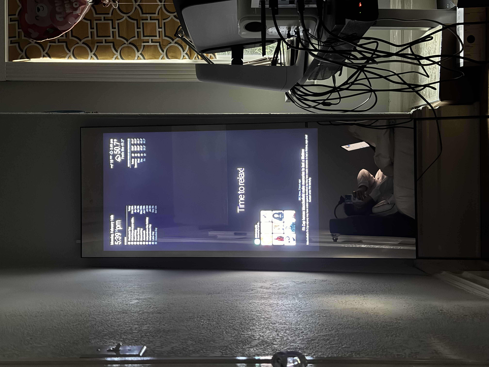
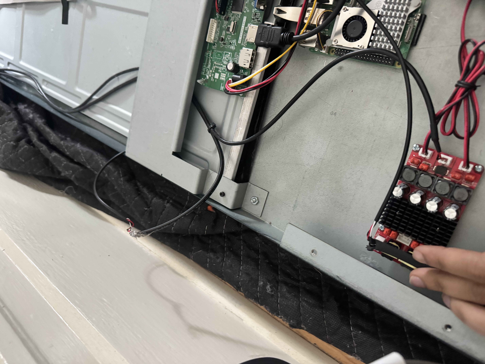
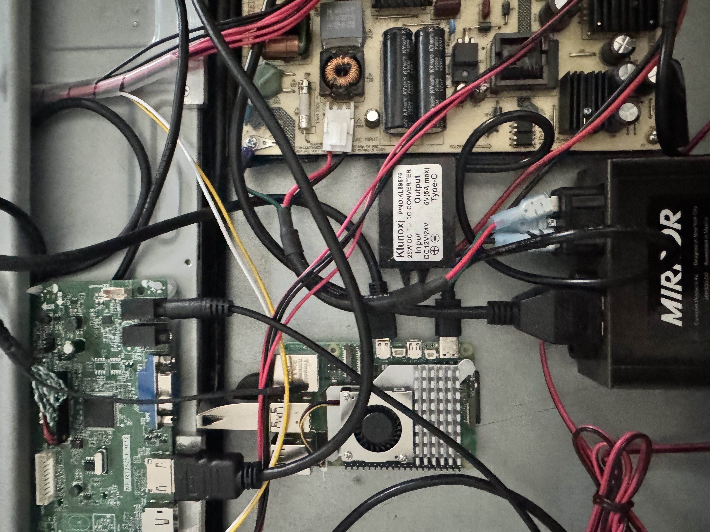

# Lululemon Mirror Project



A customized MagicMirror² installation running on a Raspberry Pi 5 with an **LM40SAMFHD700AG25WV** controller board.

This project is configured for a vertical (portrait) display used as a smart mirror, featuring advanced hardware control and remote management.

## Hardware
*   **Computer**: Raspberry Pi 5 (running Wayfire/Wayland)
*   **Display Controller**: LM40SAMFHD700AG25WV
*   **Control Interface**: DDC/CI via `ddcutil`
*   **Power System**:
    *   **Integrated Supply**: MEGMEET MP118TX (Monitor's internal PSU).
    *   **Integration**: Tapping into the **12V rail**.
    *   **Conversion**: [Klnuoxj 12V to 5V 3A USB-C Buck Converter](https://www.amazon.com/Klnuoxj-Converter-Interface-Waterproof-Compatible/dp/B0CRVW7N2J) powering the Raspberry Pi 5 directly from the monitor board.

## Hardware Integration

Here are some photos of the internal setup, highlighting the controller board, power distribution, and speaker wiring.





## Key Features

### 🖥️ Display Control
*   **Portrait Mode**: The system is permanently configured for 90-degree rotation.
*   **Smart Power**:
    *   Turn the monitor ON/OFF remotely.
    *   **Auto-Rotation Fix**: Automatically re-applies rotation rules when the monitor wakes up to prevent orientation reset issues.
    *   **State Persistence**: Uses a file-based lock (`monitor_status.txt`) to ensure the remote control always shows the correct power state, even after reboots or browser refreshes.

### 🔊 Sound Management
*   **Hardware Volume**: Direct control of the monitor's built-in speakers via DDC commands.
*   **Mute Toggle**: One-click mute/unmute from the remote interface.
*   **Auditory Feedback**: Plays a subtle "ding" sound when volume is adjusted to confirm the command was received.

### 🎵 Spotify Connect
*   **Mirror as Speaker**: The Pi acts as a Spotify Connect speaker device named "MagicMirror" via [Raspotify](https://github.com/dtcooper/raspotify) (librespot).
*   **Now Playing Display**: The `MMM-OnSpotify` module shows album art, track info, and playback controls on the mirror.
*   **Audio Output**: Routed through PipeWire → HDMI to the monitor's built-in speakers at 320kbps.
*   **System Tweaks Applied**:
    *   IPv6 disabled on wlan0 (NetworkManager) — fixes Spotify dealer websocket connection failures.
    *   `pipewire-alsa` installed — bridges librespot's ALSA backend to PipeWire.
    *   Raspotify runs as `duncandonuts` user (systemd override) to access the PipeWire audio session.

### 📱 Remote Interface
*   **Enhanced UI**: Custom brightness and volume sliders added to `MMM-Remote-Control`.
*   **Real-time Sync**: Power and volume changes are synchronized instantly across all connected remote devices.

## Spotify Connect Troubleshooting

If the mirror stops showing up as a Spotify device:
```bash
# Check service status
systemctl status raspotify

# Restart the service
sudo systemctl restart raspotify

# View logs for errors
journalctl -u raspotify --no-pager -n 30

# If "Network is unreachable" appears, verify IPv6 is disabled
nmcli con show "netplan-wlan0-DuncanDonuts" | grep ipv6.method
# Should show: ipv6.method: disabled
```

## Installation

This repository is a fork of [MagicMirror²](https://github.com/MagicMirrorOrg/MagicMirror).
To use this configuration, clone this repository and install dependencies:

```bash
git clone https://github.com/zarif98/lululemon-mirror-project.git
cd lululemon-mirror-project
npm install
```

## Credits
Based on the amazing work by the [MagicMirror² Community](https://magicmirror.builders/).
